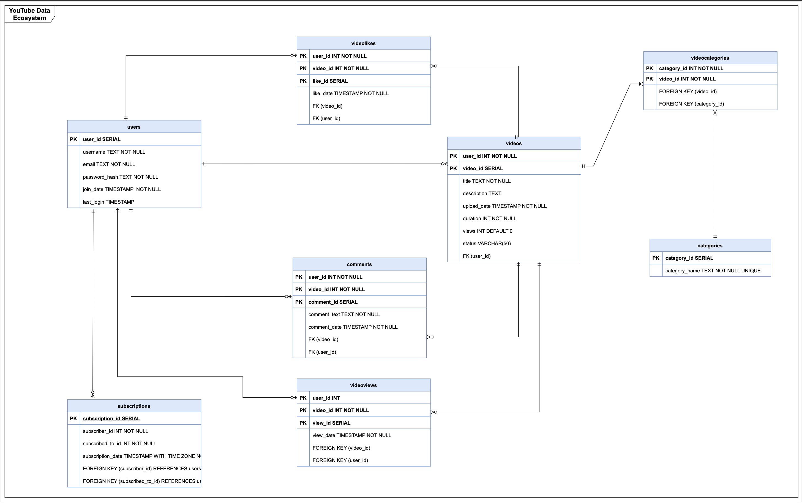

# Translating RDBMS Schema to Cassandra for YouTube Application

## Introduction

This project focuses on the translation of RDBMS schemas into Cassandra schemas, specifically tailored for big data applications using YouTube as a case study. The aim is to harness Cassandra's capabilities for fast reads and writes, as well as horizontal scalability, to address the demands of handling large volumes of data. Our project involves analyzing the RDBMS schema, identifying essential queries, and designing a Cassandra schema using a "Query First" approach. The scope encompasses documenting the RDBMS schema, designing CQL queries, and creating Cassandra schema tables, partitions, and clustering columns.

### Objectives
- To create and analyse a normalised RDBMS schema design and discuss its key componenets and relationships
- Develop queries to drive Cassandra schema design, utilizing the "Query First" approach to convert RDBMS schema into Cassandra schema, while emphasizing disparities in data modeling between Cassandra and traditional RDBMS.
- Reflect on the challenges and considerations encountered during the translation process, and discuss the trade-offs of using Cassandra over traditional RDBMS in the context of the YouTube application.
- Summarize the learning outcomes and potential real-world implications of the schema design decisions made throughout the project.

### Significance
The project's significance lies in its exploration of transitioning from an RDBMS to Cassandra, underlining the importance of understanding application query patterns and embracing denormalization for enhanced performance and scalability. Focused on YouTube as a case study, it offers insights into real-world schema translation challenges and underscores Cassandra's aptitude for handling large data volumes. Moreover, the project deepens comprehension of Cassandra's data modeling principles, highlighting its advantages in scalability and performance, despite schema translation complexities, making it a compelling choice for applications like YouTube with heavy read and write requirements. We have also successfully inserted data, further enriching the project's depth and relevance.

## RDBMS Schema Analysis
The RDBMS schema designed for the YouTube application is detailed below, highlighting its key components, relationships, and assumptions made about the data and its usage. The schema is normalized to ensure data integrity and reduce redundancy.

#### ERD:


#### Tables:
1. **Users Table:**
   - Contains information about users such as user ID, username, email, password hash, join date, and last login date.
   - Primary key: user_id.
    ```sql
   CREATE TABLE users (
    user_id VARCHAR PRIMARY KEY,
    username TEXT NOT NULL,
    email TEXT NOT NULL UNIQUE,
    password_hash TEXT NOT NULL,
    join_date TIMESTAMP WITH TIME ZONE NOT NULL,
    last_login TIMESTAMP WITH TIME ZONE
    );
    ```
   
2. **Videos Table:**
   - Stores data related to videos uploaded by users including video ID, user ID of the uploader, title, description, upload date, duration, views, and status.
   - Primary key: video_id.
   - Foreign key: user_id references the Users Table.
    ```sql
   CREATE TABLE videos (
    video_id VARCHAR PRIMARY KEY,
    user_id VARCHAR NOT NULL,
    title TEXT NOT NULL,
    description TEXT,
    upload_date TIMESTAMP WITH TIME ZONE NOT NULL,
    duration INT NOT NULL, -- assuming duration in seconds
    views INT DEFAULT 0,
    status VARCHAR(50),
    FOREIGN KEY (user_id) REFERENCES users(user_id)
    );
    ```

3. **Comments Table:**
   - Holds comments made by users on specific videos, including comment ID, user ID of the commenter, video ID of the commented video, comment text, and comment date.
   - Primary key: comment_id.
   - Foreign keys: user_id and video_id reference the Users and Videos Tables respectively.
    ```sql
   CREATE TABLE comments (
    comment_id VARCHAR PRIMARY KEY,
    user_id VARCHAR NOT NULL,
    video_id VARCHAR NOT NULL,
    comment_text TEXT NOT NULL,
    comment_date TIMESTAMP WITH TIME ZONE NOT NULL,
    FOREIGN KEY (video_id) REFERENCES videos(video_id),
    FOREIGN KEY (user_id) REFERENCES users(user_id)
    );
   ```
4. **VideoLikes Table:**
   - Records likes given by users to videos, with like ID, user ID of the liker, and video ID of the liked video.
   - Primary key: like_id.
   - Foreign keys: user_id and video_id reference the Users and Videos Tables respectively.
    ```sql
   CREATE TABLE videolikes (
    like_id VARCHAR PRIMARY KEY,
    user_id VARCHAR NOT NULL,
    video_id VARCHAR NOT NULL,
    FOREIGN KEY (video_id) REFERENCES videos(video_id),
    FOREIGN KEY (user_id) REFERENCES users(user_id)
    );
   ```
5. **Subscriptions Table:**
   - Tracks user subscriptions to other users, with subscription ID, subscriber ID, subscribed-to ID, and subscription date.
   - Primary key: subscription_id.
   - Foreign keys: subscriber_id and subscribed_to_id reference the Users Table.
    ```sql
   CREATE TABLE subscriptions (
    subscription_id VARCHAR PRIMARY KEY,
    subscriber_id VARCHAR NOT NULL,
    subscribed_to_id VARCHAR NOT NULL,
    subscription_date TIMESTAMP WITH TIME ZONE NOT NULL,
    FOREIGN KEY (subscriber_id) REFERENCES users(user_id),
    FOREIGN KEY (subscribed_to_id) REFERENCES users(user_id)
    );
   ```
6. **Categories Table:**
   - Stores video categories with category ID and category name.
   - Primary key: category_id.
   - Unique constraint: category_name.
    ```sql
   CREATE TABLE categories (
    category_id VARCHAR PRIMARY KEY,
    category_name TEXT NOT NULL UNIQUE
    );
   ```
7. **VideoCategories Table:**
   - Represents a many-to-many relationship between videos and categories, linking video IDs with category IDs.
   - Composite primary key: (video_id, category_id).
   - Foreign keys: video_id references the Videos Table, category_id references the Categories Table.
    ```sql
   CREATE TABLE videocategories (
    category_id VARCHAR NOT NULL,
    video_id VARCHAR NOT NULL,
    PRIMARY KEY (video_id, category_id),
    FOREIGN KEY (video_id) REFERENCES videos(video_id),
    FOREIGN KEY (category_id) REFERENCES categories(category_id)
    );
   ```
8. **VideoViews Table:**
   - Records views on videos, with view ID, user ID of the viewer (nullable for non-logged-in users), and video ID of the viewed video.
   - Primary key: view_id.
   - Foreign keys: user_id and video_id reference the Users and Videos Tables respectively.
   ```sql
    CREATE TABLE videoviews (
    view_id VARCHAR PRIMARY KEY,
    user_id VARCHAR,-- This can be NULL to track views from non-logged in users
    video_id VARCHAR NOT NULL,
    FOREIGN KEY (video_id) REFERENCES videos(video_id),
    FOREIGN KEY (user_id) REFERENCES users(user_id)
    );
    ```
#### Relationships:
- Users can upload videos (one-to-many relationship between Users and Videos).
- Users can leave comments on videos (one-to-many relationship between Users and Comments, and Videos and Comments).
- Users can like videos (one-to-many relationship between Users and VideoLikes, and Videos and VideoLikes).
- Users can subscribe to other users (one-to-many relationship between Users and Subscriptions).
- Videos can belong to multiple categories, and categories can have multiple videos (many-to-many relationship between Videos and Categories via the VideoCategories Table).
- Users can view videos (one-to-many relationship between Users and VideoViews, and Videos and VideoViews).

#### Assumptions:
- The view_id in the VideoViews Table is assumed to be unique to track individual views.
- The user_id in the VideoViews Table can be NULL to accommodate views from non-logged-in users.
- The subscription_date in the Subscriptions Table represents the date when the subscription was made.
- The comment_date in the Comments Table represents the date and time when the comment was posted.
- The last_login in the Users Table represents the date and time of the user's last login activity.
- The upload_date in the Videos Table and the comment_date in the Comments Table are timestamps with time zone data types to accurately record the time of events regardless of the user's location.


## Query Analysis

This section lists and analyzes the essential queries for the YouTube application's functionality. The analysis guides the translation of the RDBMS schema into a Cassandra schema, focusing on optimizing these queries.

### Essential Queries

Below queries considered essential for the application.
## 1. Retrieving user information:

```sql
-- This query retrieves the user profile by their unique user ID.
SELECT * FROM users WHERE user_id = 'UC_YO8yjS9';
```
| User_ID     | username | email                     | password_hash                             | join_date                    | last_login          |
| ----------- | -------- | ------------------------- | ----------------------------------------- | ---------------------------- | ------------------- |
| UC_Y08yjS9  | austin38 | emckenzie@example.org     | 77b43822c318be1c618c2c047e80731be5adc19f | 2023-09-23 14:34:50.569 -0400 | 2024-03-23 14:34:50 |

## 2. Listing videos uploaded by a specific user:

```sql
-- This query lists all the videos uploaded by a specific user identified by their user_id.
SELECT * FROM videos WHERE user_id = 'UC_YO17yjS18';
```
| video_id           | user_id    | title                        | description                                        | upload_date       |
|--------------------|------------|------------------------------|----------------------------------------------------|-------------------|
| VY0jWN51yjS5253251 | UC_Y017yjS18 | Relate easy cultural heavy. | Sort usually sport employee position. With world   | 2022-03-0803:20:39 |
| VY0jWN99yjS100101299 | UC_Y017yjS18 | Strategy deal usually participant. | High than gun develop religious claim available. C | 2020-02-0801:20:29 |
| VY0jWN320yjS321322520 | UC_Y017yjS18 | Pretty food note expert.    | Really soon sister then least off rate. Deep food F | 2023-03-0805:00:39 |

## 3. Incrementing video views:

```sql
-- This query increments the view count of a specific video identified by its video_id.
UPDATE videos SET views = views + 1 WHERE video_id = 'VYOjWN14yjS1516214';
```

## 4. Fetching comments for a specific video:

```sql
-- This query retrieves all the comments made on a specific video identified by its video_id.
SELECT * FROM comments WHERE video_id = 'VYOjWN15yjS1617215';
```
| comment_id | user_id      | video_id           | comment_text                | comment_date               |
|------------|--------------|--------------------|-----------------------------|----------------------------|
| CYOjsU970  | UC_Y027yjS28 | VY0jWN15yjS1617215 | O que o Z pequeno t fazendo a | 2021-06-12 00:00:00 -0400 |
| CYOjsU971  | UC_Y068yjS69 | VY0jWN15yjS1617215 | This is garbage             | 2022-08-22 00:00:00 -0400 |
| CYOjsU972  | UC_Y0180yjS181| VY0jWN15yjS1617215 | Drunk dancing               | 2021-08-10 00:00:00 -0400 |
| CYOjsU973  | UC_Y070yjS71 | VY0jWN15yjS1617215 | This is America with ...    | 2023-03-17 00:00:00 -0400 |

## 5. Retrieving comments made by a specific user:

```sql
-- This query retrieves all the comments made by a specific user identified by their user_id.
SELECT * FROM comments WHERE user_id = 'UC_YO13yjS14';
```
| comment_id | user_id    | video_id       | comment_text                                       | comment_date             |
|------------|------------|----------------|----------------------------------------------------|--------------------------|
| CYOjsU472  | UC_Y013yjS14 | VY0jWN8yjS9100208 | Is this an antigun video If yes then I disagree its ove | 2024-01-03 00:00:00 -0500 |
| CYOjsU594  | UC_Y013yjS14 | VY0jWN10yjS1112210 | THIS IS CHINA                                      | 2022-01-17 00:00:00 -0500 |
| CYOjsU608  | UC_Y013yjS14 | VY0jWN10yjS1112210 | Jesus yaaaaaaaaaasss                               | 2021-05-25 00:00:00 -0400 |
| CYOjsU951  | UC_Y013yjS14 | VY0jWN14yjS1516214 | Que pedo v                                         | 2023-01-01 00:00:00 -0500 |
| CYOjsU1112 | UC_Y013yjS14 | VY0jWN17yjS1819217 | The dark man rides the pald horse                 | 2023-11-07 00:00:00 -0500 |

## 6. Listing users who liked a specific video:

```sql
-- This query lists all the users who liked a specific video identified by its video_id.
SELECT u.* 
FROM users u
JOIN videolikes vl ON u.user_id = vl.user_id
WHERE vl.video_id = 'VYOjWN12yjS1314212';
```
| user_id    | username   | email                  | password_hash                             | join_date               |
|------------|------------|------------------------|-------------------------------------------|-------------------------|
| UC_Y074yjS75 | justin00   | asanchez@example.org   | 11a81eac5eb7f9f934a5b77fbc9b174987a8873c5f | 2022-10-27 05:58:28 -0400 |
| UC_Y080yjS81 | danielle70 | joshua33@example.org   | 8940b19bc74a7622e298c2ffe450ab8f923dfff9 | 2023-06-22 05:43:46 -0400 |
| UC_Y059yjS60 | jacksonchristine | klinerichard@example.com | abb7d00db719680eed2b5fd4f4d3032872ec3dbd | 2022-01-19 14:57:07 -0500 |
| UC_Y077yjS78 | uolson     | brian44@example.net    | 8ffbee0186fb84861f826bef70f43425cb56f36d | 2022-01-19 17:06:02 -0500 |

## 7. Tracking videos liked by a user:

```sql
-- This query tracks all the videos liked by a specific user identified by their user_id.
SELECT v.* 
FROM videos v
JOIN videolikes vl ON v.video_id = vl.video_id
WHERE vl.user_id = 'UC_YO11yjS12';
```
| video_id       | user_id      | title                                | description                                               | upload_date             |
|----------------|--------------|--------------------------------------|-----------------------------------------------------------|-------------------------|
| VY0jWN9yjS1011209 | UC_Y074yjS48 | Walk whom return middle ahead throw prove det | Book PM force us. Left scene evening pick organ... | 2020-03-0803:20:39 |
| VY0jWN19yjS2021219 | UC_Y055yjS56 | Whom continue itself yeah.              | Draw trouble wife focus baby movement tend ins... | 2021-08-0803:20:39 |
| VY0jWN45yjS4647245 | UC_Y052yjS53 | Most and return recently.                | Book player machine compare trial alone father... | 2023-02-0803:20:39 |
| VY0jWN50yjS5152250 | UC_Y015yjS16 | Figure across pull turn bring view old.  | Us board own late day sense knowledge. Happen ... | 2021-07-0803:20:39 |

has context menu

## 8. Viewing channel subscriptions:

### For subscriptions made by a user:

```sql
-- This query retrieves all the subscriptions made by a specific user identified by their user_id.
SELECT s.*, u.username AS subscriber_username, u2.username AS subscribed_to_username
FROM subscriptions s
JOIN users u ON s.subscriber_id = u.user_id
JOIN users u2 ON s.subscribed_to_id = u2.user_id
WHERE s.subscriber_id = 'UC_YO1yjS2';
```
| subscription_id | subscriber_id | subscribed_to_id | subscription_date        | subscriber_username | subscribed_to_username |
|-----------------|---------------|------------------|--------------------------|---------------------|------------------------|
| SY0j0200        | UC_Y01yjS2    | UC_Y0193yjS194   | 2023-12-13 00:00:00 -0500 | greenwilliam        | salazarsteph           |
| SY0j1201        | UC_Y01yjS2    | UC_Y036yjS37     | 2022-10-28 00:00:00 -0400 | greenwilliam        | scottmichael           |
| SY0j2202        | UC_Y01yjS2    | UC_Y030yjS31     | 2020-02-25 00:00:00 -0500 | greenwilliam        | tgarza                 |
| SY0j3203        | UC_Y01yjS2    | UC_Y0147yjS148   | 2022-06-23 00:00:00 -0400 | greenwilliam        | john46                 |
| SY0j4204        | UC_Y01yjS2    | UC_Y0116yjS117   | 2022-05-22 00:00:00 -0400 | greenwilliam        | morrisevan             |

### For subscriptions to a channel:

```sql
-- This query retrieves all the subscriptions to a specific channel identified by the channel's user_id.
SELECT s.*, u.username AS subscriber_username, u2.username AS subscribed_to_username
FROM subscriptions s
JOIN users u ON s.subscriber_id = u.user_id
JOIN users u2 ON s.subscribed_to_id = u2.user_id
WHERE s.subscribed_to_id = 'UC_YO1yjS2';
```

## Design Cassandra Schema

Adopting the "Query First" design philosophy, this section documents the process of translating the YouTube RDBMS schema into a Cassandra schema.

### Design Process

#### Query Optimization:
The Cassandra schema we've discussed is meticulously designed to align with the specific query requirements of our application. Let's dive into how each table in the Cassandra schema serves the essential queries identified earlier, reflecting the principle of designing around query patterns in Cassandra:

#### 1. Retrieving User Information

For operations like fetching user profiles and logging in (which may require looking up by username or email), we have proposed creating tables `users_by_username` and `users_by_email`. This design decision ensures direct and efficient access to user information using either a username or an email, which is crucial for login operations. This approach exemplifies Cassandra's design philosophy where data duplication across tables is acceptable to ensure query efficiency.

#### 2. Listing Videos Uploaded by a Specific User

The `videos_by_user` table is designed with `user_id` as the partition key and `video_id` as a clustering key. This arrangement enables the efficient retrieval of all videos uploaded by a specific user. The clustering order could further be defined to sort these videos by upload date or other relevant criteria, thus directly supporting the listing videos query.

#### 3. Incrementing Video Views

The video views are updated through the `videos_by_user` table, leveraging the video's `video_id`. By structuring the table to allow easy access via `user_id` and `video_id`, the schema supports efficient updates to the views count for any given video, reflecting the requirement for an efficient update operation for incrementing video views.

#### 4. Fetching Comments for a Specific Video

The `comments_by_video` table, with `video_id` as the partition key, is optimized for fetching all comments associated with a specific video. This design choice ensures that comments are easily and efficiently retrievable by video, supporting the query pattern for fetching video comments.

#### 5. Retrieving Comments Made by a Specific User

Similarly, the `comments_by_user` table uses `user_id` as the partition key, facilitating the efficient retrieval of all comments made by a specific user. This table structure is tailored to the query pattern for fetching a user's comments across videos.

#### 6. Listing Users Who Liked a Specific Video

The `likes_by_video` table is designed with `video_id` as the partition key. This table structure supports the direct and efficient retrieval of all users who have liked a particular video, directly catering to the query requirement for listing users who liked a video.

#### 7. Tracking Videos Liked by a User

For tracking which videos a user has liked, the `likes_by_user` table, with `user_id` as the partition key, enables the application to efficiently list all videos liked by a specific user. This design is an example of tailoring your data model to support specific read patterns, in this case, tracking likes by a user.

#### 8. Viewing Channel Subscriptions

The `subscriptions_by_user` table uses `subscriber_id` as the partition key, enabling efficient queries to view all channels a user is subscribed to. This table design is optimized for the subscription viewing pattern, ensuring that subscription information is easily accessible by subscriber ID.

### Final Cassandra Schema

#### Table Designs:
Below are the tables created in Casandra along with partitions and clustering columns. Its followed by the list of CQL queries which were discussed above in the deisgn process.

### 1. Users Table

For user operations like fetching profiles, logging in, and updating details, we can keep a structure similar to the relational `users` table, but with Cassandra's data type adjustments.

```cql
CREATE TABLE users (
    user_id uuid PRIMARY KEY,
    username text,
    email text,
    password_hash text,
    join_date timestamp,
    last_login timestamp
);
```

### 2. Videos by User

To list videos uploaded by a user, creating a table that partitions videos by user_id. This table allows efficient retrieval of videos for a given user.

```cql
CREATE TABLE videos_by_user (
    user_id uuid,
    video_id uuid,
    title text,
    description text,
    upload_date timestamp,
    duration int,
    views int,
    status text,
    PRIMARY KEY (user_id, video_id)
) WITH CLUSTERING ORDER BY (upload_date DESC);
```

### 3. Comments for a Video

To fetch comments for a specific video, model comments around video_id.

```cql
CREATE TABLE comments_by_video (
    video_id uuid,
    comment_id uuid,
    user_id uuid,
    comment_text text,
    comment_date timestamp,
    PRIMARY KEY (video_id, comment_id)
) WITH CLUSTERING ORDER BY (comment_date DESC);
```

### 4. Comments by a User

Similarly, for retrieving comments made by a user:

```cql
CREATE TABLE comments_by_user (
    user_id uuid,
    comment_id uuid,
    video_id uuid,
    comment_text text,
    comment_date timestamp,
    PRIMARY KEY (user_id, comment_date)
) WITH CLUSTERING ORDER BY (comment_date DESC);
```

### 5. Users who Liked a Video

To list users who liked a video, you can create a table based on `video_id`.

```cql
CREATE TABLE likes_by_video (
    video_id uuid,
    user_id uuid,
    like_date timestamp,
    PRIMARY KEY (video_id, user_id)
);
```

### 6. Videos Liked by a User

Track which videos a user has liked:

```cql
CREATE TABLE likes_by_user (
    user_id uuid,
    video_id uuid,
    like_date timestamp,
    PRIMARY KEY (user_id, video_id)
);
```

### 7. Viewing Channel Subscriptions

Subscriptions can be modeled to easily retrieve who a user is subscribed to.

```cql
CREATE TABLE subscriptions_by_user (
    subscriber_id uuid,
    subscribed_to_id uuid,
    subscription_date timestamp,
    PRIMARY KEY (subscriber_id, subscribed_to_id)
);
```

### 8. Tracking Video Views by Video
Below design would typically focus on the video_id as the partition key to facilitate efficient retrieval of views per video. 

```cql
CREATE TABLE video_views_by_video (
    video_id uuid,
    view_id uuid,
    user_id uuid,
    view_date timestamp,
    PRIMARY KEY (video_id, view_date, user_id)
) WITH CLUSTERING ORDER BY (view_date DESC);
```

### Considerations

- Each use case is backed by a specific table designed to satisfy the query efficiently.
- Redundancy is expected and normal in NoSQL databases like Cassandra to facilitate fast reads.

## CQL Queries as per YouTube Usecase

### 1. Retrieve all videos uploaded by a specific user
```cql
SELECT * FROM videos_by_user WHERE user_id = 'UC_YO8yjS9';
```

### 2. Retrieve all comments on a specific video
```cql
SELECT * FROM comments_by_video WHERE video_id = 'VYOjWN14yjS1516214';
```

### 3. Retrieve all comments made by a specific user
```cql
SELECT * FROM comments_by_user WHERE user_id = 'UC_YO13yjS14';
```

### 4. Listing users who liked a specific video
```cql
SELECT * FROM likes_by_video WHERE video_id = 'VYOjWN15yjS1617215';
```

### 5. Tracking videos liked by a user
```cql
SELECT * FROM likes_by_user WHERE user_id = 'UC_YO13yjS14';
```

### 6. Viewing channel subscriptions
```cql
SELECT * FROM subscriptions_by_user WHERE subscriber_id = 'UC_YO1yjS2';
```

#### Design Decisions:
The design decisions made in adapting the above schema for Cassandra from a traditional RDBMS context are deeply influenced by the need to achieve high performance and scalability, especially in distributed systems environments. Here's a justification of these design decisions, focusing on how they contribute to performance and scalability:

- **Denormalization and Redundancy**

    In traditional RDBMS systems, normalization is a core principle used to reduce redundancy and ensure data integrity. However, this often requires complex joins to reconstruct data for queries, which can become a performance bottleneck in distributed systems. Cassandra's emphasis on denormalization and redundancy is a strategic choice designed to minimize the need for joins, thereby significantly improving read performance. Storing data in the form it will be queried allows for fast, direct lookups without the overhead of assembling data from multiple tables.

- **Schema Design Based on Query Patterns**

    Cassandra requires a schema design that is closely aligned with query patterns. This design approach ensures that each query can be served efficiently by directly accessing a table optimized for that query, thus reducing the read and write latencies. By tailoring the data model to the application's access patterns, Cassandra can offer rapid responses to client requests, enhancing user experience and system throughput.

- **Primary Key and Data Distribution**

    The choice of partition key in Cassandra is critical as it determines how data is distributed across the cluster. A well-chosen partition key ensures uniform data distribution, avoiding hotspots and ensuring that no single node becomes a bottleneck. This uniform distribution is essential for scalability, as it ensures that the addition of nodes linearly increases the capacity of the system. Clustering columns, part of the primary key, allow for efficient sorting and retrieval within a partition, further optimizing access patterns.

- **Horizontal Scalability**

    Cassandra's data model and architecture are designed for horizontal scalability, meaning that it can handle increased load by adding more nodes to the cluster without significant reconfiguration. This scalability is achieved through data partitioning and replication, which allow the database to distribute loads evenly across the cluster and ensure data availability even in the face of node failures. This design is crucial for applications that require high availability and the ability to scale on demand.

- **Eventual Consistency Model**

    Cassandra adopts an eventual consistency model to maximize availability and partition tolerance, key components of the CAP theorem. This model allows Cassandra to continue operations even when some nodes are unreachable, ensuring that writes are not lost and can be replicated across the cluster once the affected nodes are back online. The ability to tune the consistency level for reads and writes allows developers to make trade-offs between consistency, availability, and latency based on the specific needs of their application.

- **Write and Read Throughput**

    Cassandra's write-optimized storage engine and the use of partition keys for data distribution lead to high write and read throughput. The architecture is designed to absorb high write loads by evenly distributing data across the cluster, thereby avoiding write bottlenecks. For reads, Cassandra's data model, which encourages storing data in the form it will be queried, enables efficient data retrieval without the need for resource-intensive operations like joins.

## Discussion
In this section, let's discuss on the challenges we faced during the translation process along with the considerations made and trade-offs in using Cansandra model.

### Challenges and Considerations

- **Query First Design:** Unlike RDBMS, where we had Entities, and relationships described in an ERD and we can make the whole DB normalized and then the DB would be flexible enough to support all type of operations to be performed on the Database. But in case of Cassandra, we first had to understand our use case that is YouTube in our case where we first planned all the queries that we needed to make and then we designed the architecture of Cassandra tables as per the queries for efficient retrieval and faster reads and writes.
- **Query Flexibility:** Unlike RDBMS which is flexible to enough various operations possible on data with the help of Joining several tables together and achieve consistency all along but in the case of Cassandra, we are missing Joins. So two things comes to our rescue, either can make data redundant everywhere using query first approach and trust developers that they will handle the transaction of updating the data at all places or else we can do application level joins. Using Hybrid blend of above two methods is the best way to design an application but is challenging as well at the same time.
- **Data Consistency:** Since in RDBMS, data is always normalized and non-reduandant so consistency can never be a problem. But in Cassandra, we have replicas of data in several nodes as well as in different tables as well. Just as if a user updates his information in a table, the same has to be reflected back in different tables as well as in different nodes carrying its replica. To maintain such consistency and eventual consistency is a challenge to maintain.

### Trade-offs

- **Scalability:** Cassandra shines in scenarios requiring horizontal scalability. It allows the YouTube application to handle massive volumes of data across many nodes efficiently, something that traditional RDBMS might struggle with at scale. This is a significant advantage for a global platform like YouTube, where data growth is continuous and exponential.
- **Availability:** Cassandra's distributed nature ensures high availability, with no single point of failure. This is crucial for a service like YouTube, where downtime directly impacts user experience and revenue.
- **Write Performance:** Cassandra offers excellent write performance across distributed architectures, making it suitable for write-heavy applications like YouTube, where new data (videos, comments, likes) are continuously being added.
- **Read Performance:** With a well-designed schema, Cassandra can also provide efficient read operations, particularly for use cases where data is read frequently but updated less often, such as video views or user profiles in YouTube.
- **Operational Complexity vs. Flexibility:** While Cassandra reduces some operational complexities related to scalability and availability, it introduces others, such as the need for careful data model planning and the management of data duplication. This trade-off requires a careful consideration of the application's specific needs and long-term maintenance capabilities.

## Conclusion

The project of translating a traditional RDBMS schema to a Cassandra schema for an application akin to YouTube offers profound insights into the intricacies of data modeling in NoSQL environments, specifically within the domain of high-scalability requirements. Here are the key learning outcomes and their potential real-world implications:

### Key Learning Outcomes

- **Data Modeling Around Queries:** One of the cardinal principles in using Cassandra effectively is the practice of modeling your data based on the queries you intend to run, rather than trying to fit your queries to a predetermined data model. This approach ensures that each query can be served with the utmost efficiency, directly impacting the application's responsiveness and user experience.
- **The Importance of Denormalization:** Embracing denormalization and understanding how to manage data duplication across tables are crucial. This strategy significantly differs from the normalization practices in RDBMS and is key to achieving high read and write performance in distributed systems like Cassandra.
- **Scalability and Performance:** The schema design decisions directly impact the application's ability to scale and perform under the pressures of big data. Cassandra's model facilitates linear scalability, allowing the YouTube application to grow seamlessly as demand increases.
- **Consistency vs. Availability:** The trade-offs between consistency and availability, as dictated by the CAP theorem, become starkly evident in this project. Cassandra's eventual consistency model, tuned for high availability and partition tolerance, requires a different approach to handling data integrity, especially in globally distributed applications.

### Real-world Implications

- **User Experience:** Fast read and write operations, facilitated by efficient schema design, ensure that users experience minimal latency when accessing videos, posting comments, or viewing recommendations. This responsiveness is crucial for user retention and engagement in competitive online spaces.
- **Operational Efficiency:** The ability to scale horizontally with ease means that the YouTube application can handle peak loads without significant rearchitecting or downtime for maintenance. This operational efficiency translates to cost savings and improved service reliability.
- **Data Integrity and Management:** While Cassandra's design optimizes for performance and scalability, it imposes an additional burden on application developers to manage data consistency across denormalized tables. This could require more sophisticated application logic or background processes to ensure data integrity, impacting development and operational overhead.
- **Global Reach:** The distributed nature of Cassandra's architecture makes it well-suited for applications requiring global reach. Data can be replicated across geographically dispersed data centers, reducing latency for users worldwide and enhancing the application's availability and disaster recovery capabilities.

### Influence on Performance and Scalability

- **Performance:** Direct access patterns designed into the schema mean that data can be retrieved with minimal overhead, supporting high-throughput and low-latency operations essential for a fluid user experience in a data-intensive application like YouTube.
- **Scalability:** The schema's design inherently supports distributed data storage, enabling the YouTube application to scale out across multiple servers and data centers. This capability is essential for accommodating the exponential growth in users and data volume, characteristic of successful online platforms.

## References
- All the resources including SQL Statements, CQL Statements, ZShell Commands and sample data that we generated using Python scripts can be found here, [text](https://github.com/ISM6562-Big-Data/TEAM-APOGEE/tree/main/A3-Cassandra-Query-First-Design/Resources)

